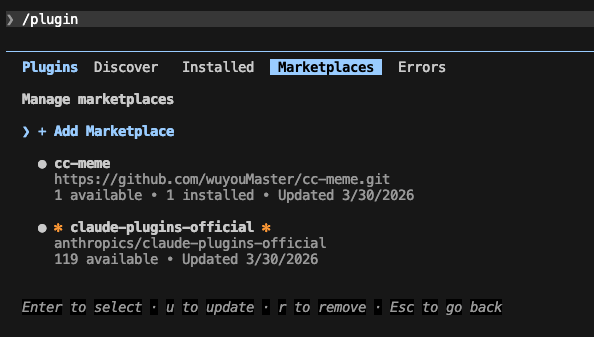

# cc-meme

<p align="center">
  
  
  
  
</p>

<p align="center">
  A floating animation overlay for <a href="https://docs.anthropic.com/en/docs/claude-code">Claude Code</a>
</p>

<p align="center">
  <a href="./README.md">中文</a> | English
</p>

---

## ✨ Introduction

cc-meme is a Hook plugin for [Claude Code](https://docs.anthropic.com/en/docs/claude-code) that displays a floating animation overlay during coding sessions, making the development experience more fun.

It listens to Claude Code events (session start, tool calls, errors, etc.) and communicates with the [meme-overlay](https://github.com/wuyouMaster/opencode-overlay) desktop app via POSIX named pipes (FIFO) to show real-time task progress.

> ⚠️ **Prerequisite**: This plugin requires the [meme-overlay](https://github.com/wuyouMaster/opencode-overlay) desktop application.

---

## ✨ Features

- **Event-driven** — Listens to 8 Claude Code Hook events
- **FIFO IPC** — Communicates with the overlay process via POSIX named pipes; hook calls are lightweight and non-blocking
- **Auto-management** — Automatically starts/restarts the overlay process; cleans up on session end
- **Custom animations** — Assign different animations and text to different events via config
- **Zero latency** — Hooks run as async commands, no impact on Claude Code responsiveness

### Supported Hook Events

| Hook Event | Trigger | Default Text |
|-----------|---------|--------------|
| `SessionStart` | Session starts/resumes | "Starting..." |
| `UserPromptSubmit` | User submits a prompt | First 60 chars of prompt |
| `PreToolUse` | Before tool execution | Tool name |
| `PostToolUse` | After tool execution | Tool name |
| `PostToolUseFailure` | Tool execution fails | Tool name |
| `Stop` | Claude finishes responding | "Done" |
| `StopFailure` | Response terminates abnormally | "Error" |
| `Notification` | Notification (waiting/permission) | "Waiting for input..." / "Permission needed" |

---

## 🚀 Usage

### 1. Install meme-overlay

Please refer to the [meme-overlay](https://github.com/wuyouMaster/opencode-overlay) repository to install the desktop application and configure animations.

### 2. Configure

**Using Claude Code Plugin System (recommended):**

```bash
vim ~/.claude/settings.json
# Add the following configuration
{
    "extraKnownMarketplaces": {
        "cc-meme": {
            "source": {
                "source": "git",
                "url": "https://github.com/wuyouMaster/cc-meme.git"
            }
        }
    },
    "enabledPlugins": {
        "cc-meme@cc-meme": true
    }
}
```

Start Claude Code, then type `/plugin` to enter the following page. Select cc-meme, press Enter to see the cc-meme plugin. After installation, exit and restart Claude Code.



The plugin will automatically register all Hook events defined in `hooks/hooks.json`, no need to manually edit `settings.json`.

### Prerequisites

| Dependency | Version | Description |
|------------|---------|-------------|
| [Node.js](https://nodejs.org/) | 18+ | Runs the hook script |
| [Claude Code](https://docs.anthropic.com/en/docs/claude-code) | 1.0.33+ | AI coding assistant |
| [meme-overlay](https://github.com/wuyouMaster/opencode-overlay) | 0.1+ | Floating animation desktop app |
---

## ⚙️ Configuration

### Config File

Configuration is located at `~/.config/meme-overlay/config.json`:

```json
{
  "cc": {
    "hook_assignments": {
      "cc.session.start": {
        "animation": "thinking",
        "custom_text": "Starting..."
      },
      "cc.tool.before": {
        "animation": "coding",
        "custom_text": null
      },
      "cc.tool.after": {
        "animation": "coding",
        "custom_text": "Done"
      },
      "cc.stop": {
        "animation": "success",
        "custom_text": "Done"
      }
    }
  }
}
```

### Environment Variables

| Variable | Description | Example |
|----------|-------------|---------|
| `OVERLAY_BIN` | Custom overlay executable path | `/usr/local/bin/meme-overlay` |

---

## 🛠️ Development

```bash
# Install dependencies
npm install

# Build
npm run build

# Run directly (for debugging)
node dist/cc-meme.js
```

### Project Structure

```
cc-meme/
├── .claude-plugin/
│   └── plugin.json     # Claude Code plugin manifest
├── hooks/
│   └── hooks.json      # Hook event configuration
├── bin/                # Build output (generated after build)
│   └── cc-meme.js
├── cc-meme.ts          # Hook entry script source
├── package.json
└── tsconfig.json
```

### How It Works

```
Claude Code Event
      │
      ▼
  cc-meme.ts (new process per event)
      │
      │  FIFO named pipe (O_RDWR | O_NONBLOCK)
      ▼
  meme-overlay persistent process
      │
      ▼
  Transparent floating animation window
```

Since Claude Code hooks are **short-lived processes** triggered per event (unlike OpenCode's long-running plugin), cc-meme uses POSIX FIFO named pipes for IPC: the overlay process holds the read end of the pipe, and each hook call opens the pipe in non-blocking mode to write commands.

---

## 🔧 Troubleshooting

| Issue | Steps |
|-------|-------|
| Overlay not showing | Verify `~/.config/meme-overlay/bin/meme-overlay` exists and is executable |
| Hooks not triggered | Check hooks config in `~/.claude/settings.json` |
| Pipe errors | Delete `~/.config/meme-overlay/overlay.pipe` and restart |
| Animations not playing | Check if animation files exist in `~/.config/meme-overlay/animations/` |

---

## 📄 License

[MIT](LICENSE)
